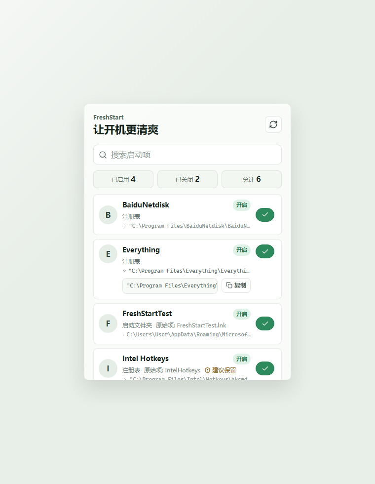
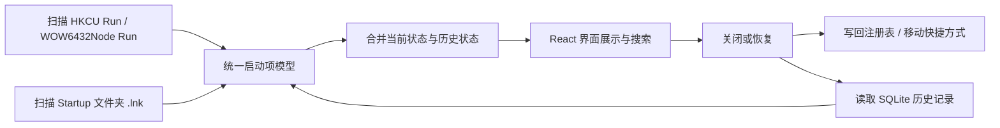

# FreshStart

FreshStart 是一个轻量、清爽、可恢复的 Windows 开机自启管理面板。它把常见的当前用户启动项集中到一个小窗口里，支持查看、搜索、关闭、恢复，并用本地 SQLite 记住历史记录，避免“关掉以后下次就找不到了”。



## 快速体验

仓库根目录提供了一个已构建的体验版：

```powershell
.\freshstart.exe
```

适用环境：

- Windows 10 / Windows 11
- 建议系统已安装 Microsoft Edge WebView2 Runtime。多数新系统已自带；如果目标机器缺失，Tauri 窗口可能无法正常打开。

## 它能做什么

- 扫描当前用户的注册表自启项：
  - `HKCU\Software\Microsoft\Windows\CurrentVersion\Run`
  - `HKCU\Software\WOW6432Node\Microsoft\Windows\CurrentVersion\Run`
- 扫描当前用户 Startup 文件夹里的 `.lnk` 快捷方式。
- 添加新的开机自启项：
  - 点击 `+` 后粘贴 exe 路径。
  - 在桌面版 WebView 能提供真实路径时，也可以把 exe 拖入窗口自动填入。
  - 默认写入当前用户 `HKCU Run`，不需要用户理解注册表。
- 开关启动项：
  - 注册表项关闭时删除对应值，恢复时写回原命令。
  - Startup 快捷方式关闭时移动到 FreshStart 的禁用备份目录，恢复时移回原位置。
- 使用 SQLite 持久化历史记录：
  - 见过的启动项会被记住。
  - 即使某个启动项当前已被移除，下次打开仍可在列表里看到并尝试恢复。
- 优化显示名称：
  - 优先从启动命令解析真实 exe。
  - 尝试读取 Windows 版本资源里的 `FileDescription` / `ProductName`。
  - 对部分常见软件做友好名称映射，例如百度网盘、微信、Teams、Edge、OneNote。
- 完整路径可展开、横向滚动、选择和复制。
- 对部分建议保留或风险项做提示确认。

## 局限性

FreshStart 当前是一个保守的当前用户启动项管理工具，不是完整的系统启动审计工具。

当前不会扫描或修改：

- `HKLM` 系统级启动项
- Windows Services
- Drivers
- Scheduled Tasks
- 浏览器插件、应用内部自启动设置
- 安全软件或驱动级常驻组件

手动添加功能当前也只支持 `.exe` 程序，不支持 `.bat`、`.cmd`、`.ps1`、服务或计划任务。`cmd.exe`、`powershell.exe`、`rundll32.exe`、`wscript.exe` 等命令解释器/脚本宿主会被拒绝添加。

因此，有些软件“看起来会开机启动”，但如果它们来自服务、计划任务或应用内部机制，FreshStart 可能不会显示。这是有意为之：第一阶段优先保证可恢复、低风险、不会误动系统级配置。

## 数据与隐私

运行时数据保存在当前用户目录下：

```text
%APPDATA%\FreshStart\
```

其中通常包括：

- `freshstart.sqlite`：历史启动项记录
- `state.json`：旧版本迁移用状态文件
- `disabled\`：被关闭的 Startup 快捷方式备份

这些文件可能包含你的真实软件名称、路径和启动命令，已经在 `.gitignore` 中永久忽略，不应提交到仓库。

仓库里只保留：

- 源码
- 配置
- 测试
- 文档
- `freshstart.exe` 体验版

## 工作原理



关闭注册表启动项时，FreshStart 会先把原命令写入 SQLite，再删除当前用户 Run 键里的对应值。恢复时会检查冲突，然后把原命令写回。

关闭 Startup 文件夹启动项时，FreshStart 会把 `.lnk` 移动到 `%APPDATA%\FreshStart\disabled\`。恢复时会检查原路径是否已有同名文件，再移回。

## 技术栈

- 桌面壳：Tauri v2
- 原生能力：Rust
- 界面：React + TypeScript
- 构建：Vite
- 样式：CSS / Tailwind 配置
- 持久化：SQLite
- 测试：Vitest + Testing Library + Playwright + Rust unit tests

## 开发

安装依赖：

```powershell
npm install
```

启动前端开发服务器：

```powershell
npm run dev
```

运行测试：

```powershell
npm run test:unit
npm run test:e2e
npm run tauri:test
```

构建体验版 exe：

```powershell
npm run tauri:build
```

构建完成后，脚本会把最新 release exe 复制到仓库根目录：

```text
freshstart.exe
```

## 安全说明

FreshStart 不会主动执行关机、重启、断网、关闭代理、修改服务或驱动等操作。自动化测试也避开了这类行为。

使用前建议先理解每个启动项的来源。对于驱动、热键、安全软件、厂商硬件服务等不确定项目，建议保留。
